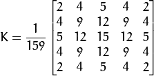
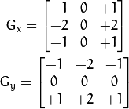
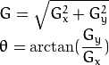

# Canny

使用OpenCV函数 [Canny](http://opencv.willowgarage.com/documentation/cpp/imgproc_feature_detection.html?#Canny) 检测边缘。

## 原理

1. *Canny 边缘检测算法* 是 John F. Canny 于 1986年开发出来的一个多级边缘检测算法，也被很多人认为是边缘检测的 *最优算法*, 最优边缘检测的三个主要评价标准是:

   - **低错误率:** 标识出尽可能多的实际边缘，同时尽可能的减少噪声产生的误报。
   - **高定位性:** 标识出的边缘要与图像中的实际边缘尽可能接近。
   - **最小响应:** 图像中的边缘只能标识一次。


   ### 步骤

   1. 消除噪声。 使用高斯平滑滤波器卷积降噪。 下面显示了一个  的高斯内核示例:

   <div align=center>
      
   </div>

   2. 计算梯度幅值和方向。 此处，按照Sobel滤波器的步骤:

      1. 运用一对卷积阵列 (分别作用于  和  方向):

      <div align=center>
         
      </div>

      2. 使用下列公式计算梯度幅值和方向:

      <div align=center>
         
      </div>

         梯度方向近似到四个可能角度之一 (一般 0, 45, 90, 135)

   3. *非极大值* 抑制。 这一步排除非边缘像素， 仅仅保留了一些细线条(候选边缘)。

   4. *滞后阈值*: 最后一步，Canny 使用了滞后阈值，滞后阈值需要两个阈值(高阈值和低阈值):

      - 如果某一像素位置的幅值超过 *高* 阈值, 该像素被保留为边缘像素。
      - 如果某一像素位置的幅值小于 *低* 阈值, 该像素被排除。
      - 如果某一像素位置的幅值在两个阈值之间,该像素仅仅在连接到一个高于 *高* 阈值的像素时被保留。

      Canny 推荐的 *高*:*低* 阈值比在 2:1 到3:1之间。

## 代码解释

1. 创建程序中要用到的变量:

   ```C++
     Mat src, src_gray;
     Mat dst, detected_edges;
   
     int edgeThresh = 1;
     int lowThreshold;
     int const max_lowThreshold = 100;
     int ratio = 3;
     int kernel_size = 3;
     char* window_name = "Edge Map";
   ```
   注意:

   - 我们首先设定高:低阈值比为 3:1 (通过变量 *ratio* )
   - 设定内核尺寸为 :math:`3` (Canny函数内部调用Sobel操作)
   - 将低阈值的上限设定为 :math:`100`。


2. 装载原图像:

   ```C++
   /// 装载图像
   src = imread(“house.jpg”);
   
   if(!src.data )
   {
       return -1; 
   }
   ```

3. 创建与 *src* 同类型和大小的矩阵(*dst*)

   ```C++
   dst.create(src.size(), src.type() );
   ```

4. 将输入图像转换到灰度空间 (使用函数 [cvtColor](http://opencv.willowgarage.com/documentation/cpp/imgproc_miscellaneous_image_transformations.html#cv-cvtcolor)):

   ```C++
   cvtColor(src, src_gray, CV_BGR2GRAY );
   ```

5. 创建显示窗口

   ```C++
   namedWindow(window_name, CV_WINDOW_AUTOSIZE );
   ```

6. 创建trackbar，来获取用户交互输入的低阈值:

   ```C++
   createTrackbar("Min Threshold:", 
                  window_name, 
                  &lowThreshold, 
                  max_lowThreshold, 
                  CannyThreshold 
                  );
   ```

   注意:

   1. 通过trackbar控制的变量为 *lowThreshold* ，上限为 *max_lowThreshold* (我们已经设定为100)
   2. 每次用户通过trackbar产生变动,回调函数 *CannyThreshold* 被调用.

7. 让我们一步一步的来观察 *CannyThreshold* 函数:

   1. 首先, 使用 3x3的内核平滑图像:

      ```C++
      blur(src_gray, detected_edges, Size(3,3) );
      ```

   2. 其次,运用 [Canny](http://opencv.willowgarage.com/documentation/cpp/imgproc_feature_detection.html?#Canny) 寻找边缘:

      ```C++
      Canny(detected_edges, 
            detected_edges, 
            lowThreshold, 
            lowThreshold*ratio, 
            kernel_size 
            );
      ```

      输入参数:

      - *detected_edges*: 原灰度图像
      - *detected_edges*: 输出图像 (支持原地计算，可为输入图像)
      - *lowThreshold*: 用户通过 trackbar设定的值。
      - *highThreshold*: 设定为低阈值的3倍 (根据Canny算法的推荐)
      - *kernel_size*: 设定为 3 (Sobel内核大小，内部使用)

8. 填充 *dst* 图像，填充值为0 (图像全黑).

   ```C++
   dst = Scalar::all(0);
   ```

9. 最后, 使用函数 [copyTo](http://opencv.willowgarage.com/documentation/cpp/core_basic_structures.html?#Mat::copyTo) 标识被检测到的边缘部分 (背景为黑色).

   ```C++
   src.copyTo(dst, detected_edges);
   ```

   [copyTo](http://opencv.willowgarage.com/documentation/cpp/core_basic_structures.html?#Mat::copyTo) 将 *src* 图像拷贝到 *dst* . 但是，仅仅拷贝掩码不为0的像素。既然Canny边缘检测的输出是镶嵌在黑色背景中的边缘像素，因此其结果 *dst* 图像除了被检测的边缘像素，其余部分都为黑色。

10. 显示结果:

    ```C++
    imshow(window_name, dst );
    ```

